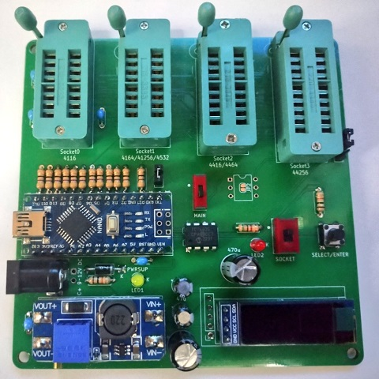

# DRAM Tester x1x4 lcd by Goripon Hardware

[English README is here](https://github.com/goriponsoft/Dram-Tester-x1x4-lcd/blob/main/README.md)

これは4116/4164/41256/4532/4416/4464/44256 DRAMに対応したLCD表示付きのスタンドアロンDRAMテスターです。直接のフォークではありませんが、[zeus074/dramtester](https://github.com/zeus074/dramtester) と [cloudree/DRAM_Tester](https://github.com/cloudree/DRAM_Tester) をベースに作成されています。原作者二人に感謝を。参考にした2つのどちらもGPL3.0ライセンスになっているため、このDRAMテスターもGPL3.0ライセンスで公開します。

このDRAMテスターはごりぽんハードウェア(同人サークルごりぽんソフトウェアのハードウェア部門)により作成されました。

X(旧Twitter): @goriponsoft

# 部品表
(回路図の更新と一致していない可能性があるため、schematic/bom.xlsxを確認してください)
|部品番号|内容|数量|
|:--|:--|--:|
|C1-C4|セラミックコンデンサ 0.1μF (耐圧16V以上)|4|
|C5,C8|電解コンデンサ 470μF (耐圧16V以上)|2|
|C6,C7|電解コンデンサ 10μF (耐圧16V以上)|2|
|IC1|DC-DCコンバータ(チャージポンプ)IC "TJ7660" (DIP 8ピン)|1|
|CN1|DCジャック "MJ-179PH"|1|
|JP1|ピンヘッダ 1x3 と ジャンパピン|1|
|JP2|ピンヘッダ 1x2 と ジャンパピン|1|
|LED1|LED 3mm 黄色(順電圧2.1V)|1|
|LED2|LED 3mm 緑色 または 赤色(順電圧2.1V)|1|
|R1-R11,R19|47Ω 1/4W 抵抗|12|
|R12,R13|47Ω 1/6W 抵抗|2|
|R14,R17|10KΩ 1/4W 抵抗|1|
|R15|1.5KΩ 1/4W (誤差が少ないもの/金属皮膜抵抗など)|1|
|R16|750Ω 1/4W (誤差が少ないもの/金属皮膜抵抗など)|1|
|R18|5.1KΩ 1/4W|1|
|S0-S1|3M ゼロプレッシャー(ZIF)ソケット 16ピン "216-3340-00-0602J"|2|
|S2|3M ゼロプレッシャー(ZIF)ソケット 18ピン "218-3341-00-0602J"|1|
|S3|3M ゼロプレッシャー(ZIF)ソケット 20ピン "220-3342-00-0602J"|1|
|SW1|6×6mm タクトスイッチ "DTS-63N-V"|1|
|SW3|ON-ON DPDT 上面スライドスイッチ スルーホールタイプ "SS22SDP2"|1|
|SW3|ON-ON SPDT 上面スライドスイッチ スルーホールタイプ "SS12SDP2"|1|
|U1|Arduino Nano|1|
|U2|MT3608 DC-DCモジュール|1|
|U3|I2C OLEDディスプレイ 0.91インチ 128x32ドット|1|
|-|各モジュール取付用のピンヘッダ|-|
|-|9V～12V センター＋ ACアダプタ|1|

# ディレクトリ構成
- firmware: Arduino Nano用のファームウェアです。
- firmware/ArduinoIDE/Dram-Tester-x1x4-lcd: Arduino IDE環境向けファームウェアのソースコードです。Arduino IDEを使ってコンパイルし、スケッチを書き込む事ができます。
- firmware/ArduinoIDE/Dram-Tester-x1x4-lcd/arduino.avr.nano/build: コンパイル済みのファームウェアです。HEXファイルをAVRライターなどで書き込むことができます。
- firmware/PlatformIO/Dram-Tester-x1x4-lcd: PlatformIO環境向けファームウェアのソースコードです。PlatformIOを使ってコンパイルし、コンパイル済みバイナリを書き込む事ができます。
- firmware/PlatformIO/Dram-Tester-x1x4-lcd/.pio/build/Arduino_nano: コンパイル済みのファームウェアです。HEXファイルをAVRライターなどで書き込むことができます。
- schematic: KiCAD7用の回路図データです。
- schematic/production: 基板発注用のガーバーデータです。

# 組み立て方
このページの完成品の写真を参考に、基板のシルク印刷に合わせ、部品を載せてハンダ付けしてください。

Arduino Nano・DCDCコンバータ基板・OLEDディスプレイについては、先に部品側にピンヘッダをハンダ付けして、その後ピンヘッダを基板に差し込んでハンダ付けしてください。それ以外には特別な手順は必要ありませんので、通常の電子回路の組み立て方に準じます。

# 準備
1. 基板に電源を接続し、メイン電源スイッチを入れ、Arduino Nanoの3.3V電源出力の電圧をテスターなどで測定し、メモしておきます。
2. Dram-Tester-x1x4-lcd.cpp(またはDram-Tester-x1x4-lcd.ino)の、setup()関数の先頭付近にある"#if 0"を"#if 1"に変更し、calibrationValue変数に値を代入している式の"3.300"の部分をメモしておいた電圧に書き換えます(誤差を気にしないのであれば3.300のままで構いませんが、電圧チェックが正しく働かないかもしれません)。
3. PCにUSBでArduino nanoを接続し、Arduino IDEを使用してコンパイルしたスケッチを書き込むか、PlatformIOやAVRライターを使用してHEXファイルを書き込みます。
4. 基板のメイン電源スイッチをオンオフするか、リセットボタンを押して、ファームウェアを起動させます(改変ファームウェアが動作し、電圧補正値がEEPROMに書き込まれます)。
5. ソースの"#if 1"を"#if 0"に戻します。
6. 再度、Arduino IDEを使用してコンパイルしたスケッチを書き込むか、PlatformIOやAVRライターを使用してHEXファイルを書き込みます。
7. 基板のメイン電源スイッチをオンにしてから、テスターで電圧を計測しながら、MT3608DCDCコンバータモジュールの半固定抵抗を回して、12Vになるよう調整します。テスターが無い場合は、SELECT/ENTERボタンを押しながら電源スイッチをオンにするかリセットして設定変更モードを起動し、電圧を表示することもできます。
8. JP1(ソケット電源LED動作)のジャンパピンを設定します。1-2のショートでON時に点灯、2-3のショートでOFF時に点灯、ジャンパピンを抜くと常時消灯です。

# 使い方
0. DCジャックにACアダプタ(センタープラス・9V～12V)を繋ぎ、メイン電源スイッチをオンにします。Arduino NanoのUSBコネクタに5V電源もしくはPCを繋ぐことでも動作させることは出来ますが、ACアダプタの使用を推奨します。
1. ソケット電源スイッチをオフにしてから、ソケットにテスト対象のDRAMを挿入します。4116であればSOCKET0、4164/41256/4532であればSOCKET1、4416/4464であればSOCKET2、44256であればSOCKET3、に挿入します。※SOCKET0に4116タイプ以外のDRAMを挿入すると壊れますので注意が必要です
2. ソケット電源スイッチをオンにしてLCDの表示を確認し、SELECT/ENTERボタン短押しで、DRAMの型番を選択します。DRAMを挿入すべきソケットもLCDに表示されるので、合っているか確認します。
3. SELECT/ENTERボタンを長押しして、テストを開始します。※安全のためソケット電源スイッチがオフの間はボタンの操作が出来なくなっています。
4. 数十秒から数分(DRAMの容量およびテストの厳密度設定により変わり、エラーが発生した場合は短くなります)待つと、結果が表示されます。
5. ソケット電源スイッチをオフにして、テストが終了したDRAMをソケットから抜去します。テスト後に別のDRAMに交換する場合も、ソケット電源スイッチをオフにしてから行ってください。

# 設定変更
SELECT/ENTERボタンを押しながらメイン電源スイッチをオンにすることで、設定変更モードで起動することが出来ます。通常時のDRAM型番選択と同様に、SELECT/ENTERボタン短押しで項目選択、長押しで決定もしくは設定変更が行なえます。

- 4bit DRAM Test: 4bit DRAMのテストを速度優先で行う("Speedy")か厳密に行う("Strict")かを選択します。
- Power5V Voltage: 5V電源の電圧をチェックし、電圧が異常な場合にテストを中止する("Check")か、無視してテストを続行するか("Ignore")を選択します。USB電源の場合、電源の電圧が降下し、テストが正しく行われない可能性があります。
- Erase EEPROM: EEPROMの内容を消去して設定を初期化することができます(補正用の値などは残ります)。消去が終了すると強制的に設定変更モードを抜けます。
- View Power12V: 12V電源の電圧と電圧誤差を表示します。12Vの電源電圧が適正でないと4116 DRAMのテストが行えません。抜ける時はリセットしてください。※ソケット電源をオフにしていると電圧が表示できません。
- View Button & Power5V: ボタンのテストと5V電源の状態を表示します。抜ける時はリセットしてください。
- Save and Exit: 変更した内容を保存し、設定変更モードを抜けて、通常のDRAM型番選択に移行します。設定変更モードを抜けない限り、変更した内容は保存されません。保存したくない場合は、この項目で決定せずリセットすることで保存を回避することができます。
